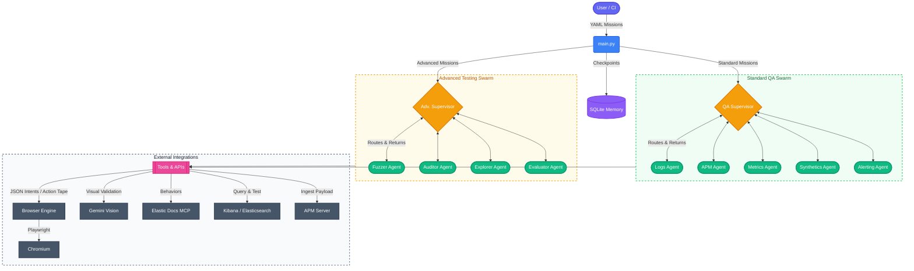

# 🤖 Elastic Observability Agentic Test Explorer

An autonomous, AI-driven exploratory Quality Assurance (QA) framework designed to intelligently explore, test, and validate Elastic Kibana's Observability modules.

Powered by a **LangGraph Swarm** architecture, **Playwright**, and **Google gemini-3.1-flash-lite-preview**, this Proof of Concept (PoC) goes beyond static testing. It dynamically routes tasks, explores the Kibana DOM, visually validates complex charts, fuzzes telemetry ingestion endpoints, self-heals from UI errors, proactively queries documentation via MCP, generates reproducible Playwright test scripts from every bug found, and writes its own Markdown executive test reports.

---

## 🏗️ Architecture

The framework is built on a **Supervisor-Worker Swarm** pattern. Based on the mission type (determined by the `thread_id` keyword), the system spins up either a **Standard** or **Advanced** routing graph.



### Architecture Details

1. **Mission Dispatcher (`main.py`)**: Loads `missions/*.yaml` files and automatically provisions the correct graph network based on naming conventions.
2. **Supervisor-Worker Flow**: A Supervisor node dynamically evaluates the workspace state and dispatches control to specialized worker nodes (e.g., Logs, APM, Fuzzer).
3. **Record-and-Translate Browser Engine** (`src/agentic_explorer/tools/browser/engine.py`): The central innovation. Agents are the *brain*—they never touch the browser directly. Instead they emit strict JSON intents to `execute_browser_command`. The engine:
   - Validates selectors against a resilience policy (rejects XPath / positional CSS at runtime).
   - Executes the command with Playwright and captures an Accessibility Tree / DOM snapshot.
   - Appends every command to an immutable **Action Tape** (`report_<thread_id>/action_tape.jsonl`).
   - On bug detection, `generate_reproduction_spec` translates the tape into a runnable `reproduction_*.spec.ts` Playwright test.
4. **Tool Modality**: Agents access bound tools — the browser engine for DOM operations, Gemini Vision for perceptual validation, and MCP (`elastic-docs`) to look up expected capabilities and avoid hallucinations.
5. **State & Memory (`agent_memory.sqlite`)**: An asynchronous SQLite checkpointer remembers agent states (including the `action_tape` field), allowing a reused `thread_id` to resume precisely where it left off.

### Source Layout
- `src/agentic_explorer/orchestration/`: standard + advanced LangGraph builders (`standard_graph.py`, `advanced_graph.py`)
- `src/agentic_explorer/tools/browser/`: Record-and-Translate browser engine (`engine.py`) — DOM snapshot, Action Tape, Playwright spec generator
- `src/agentic_explorer/tools/common/`: shared tool factories and skill integration (`custom_tools.py`)
- `src/agentic_explorer/tools/ai_assistant/`: AI Assistant evaluation and interaction tools (`tools.py`)
- `src/agentic_explorer/tools/fuzzing/`: fuzzing/injection/integrity tools (`tools.py`)
- `src/agentic_explorer/tools/skills/`: Elastic Agent Skills setup script (`setup_skills.py`)
- `src/agentic_explorer/utils/`: shared utilities (e.g. LLM JSON parsing `llm_json.py`)

Skill setup module can be run directly with:

```bash
python -m src.agentic_explorer.tools.skills.setup_skills
```

---

## ✨ Key Features

* **Multi-Agent Swarm**: Uses a routing model to distribute tasks among highly specialized AI personas depending on standard UI testing or advanced chaos/fuzzing goals.
* **Record-and-Translate Engine**: Agents emit JSON intents, the deterministic engine executes and records every step to an immutable Action Tape. Every bug automatically generates a reproducible `reproduction_*.spec.ts` Playwright script.
* **Resilient Selector Policy (Engine-Enforced)**: `execute_browser_command` rejects brittle XPath/positional selectors at runtime, enforcing `data-test-subj` → `aria-label` → visible text priority.
* **Self-Healing Browser Execution**: Playwright actions are monkey-patched to catch uncaught exceptions. Errors are returned as natural language so agents can adapt strategies.
* **Visual Validation**: Agents can take screenshots of complex Canvas/SVG elements (like Service Maps) and use Gemini Vision to analyze them for rendering anomalies.
* **Elastic MCP Integration**: Agents proactively query the Elastic Docs via the Model Context Protocol (MCP) to learn UI paths *before* executing actions.
* **Deep Telemetry & AI Evaluation**: Advanced swarms can inject malformed telemetry payloads and directly evaluate the Elastic AI Assistant's ES|QL generation capabilities.
* **Automated Artifact Generation**: Every test generates an isolated folder containing raw execution traces, the Action Tape, bug screenshots, reproducible `.spec.ts` files, and an executive Markdown report.

---

## 🛠️ Setup & Prerequisites

### 1. Dependencies
Ensure you have Python 3.11+ installed. It is highly recommended to use a virtual environment.

```bash
python -m venv venv
source venv/bin/activate

# Install dependencies
pip install -r requirements.txt
# Or with uv:
# uv sync

# Install the Playwright Chromium browser
playwright install chromium
```

### 2. Environment Variables
Create a `.env` file in the root directory and add your API keys and Elastic environment details:

```env
GOOGLE_API_KEY="your_gemini_api_key_here"
KIBANA_URL="http://localhost:5601"
KIBANA_USERNAME="elastic"
KIBANA_PASSWORD="changeme"
ELASTICSEARCH_URL="http://localhost:9200"
ELASTIC_APM_SERVER_URL="http://localhost:8200"
ELASTIC_APM_SECRET_TOKEN=""
```

### 3. Authenticate Kibana
Initialize a reusable `auth.json` cookie file. This allows headless testing without requiring the agents to process the login screen on every run.

```bash
agent-auth
```

---

## 🚀 Defining Missions & Usage

### Creating a Mission
Create YAML files (e.g., in a `missions/` directory) defining specific UI tests. Each mission needs a unique `thread_id` (for persistent memory routing) and a `prompt`.

```yaml
# missions/smoke.yaml
missions:
  - thread_id: "obs_logs_exploration_01"
    prompt: >
      Navigate to Observability Logs. Perform a KQL search for 'error'. 
      Verify the detail flyout renders correctly and highlights the search term.
```

### Running the Framework
Execute your test suite by pointing the main orchestrator to your mission file:

**Run a standard functional smoke test:**
```bash
agent-explorer --missions missions/smoke.yaml
```

**Run advanced/chaotic missions (Fuzzing, Integrity, AI Evaluation):**
```bash
agent-explorer --missions missions/advanced_all.yaml
```

**Run with a visible UI (Headed Mode) — great for debugging:**
```bash
agent-explorer --missions missions/smoke.yaml --headed
```

**Clear agent memory to restart fresh:**
```bash
agent-explorer --missions missions/smoke.yaml --clear-memory
```

**Override the supervisor step limit (default: 30):**
```bash
agent-explorer --missions missions/smoke.yaml --max-steps 50
```

---

## 📂 Project Structure

* `src/agentic_explorer/main.py`: The core CLI entry point, swarm graph compiler, transient-error retry loop, and orchestrator.
* `src/agentic_explorer/orchestration/standard_graph.py`: Swarm setup and `AgentState` definition (includes `action_tape` field) for Standard functional QA agents.
* `src/agentic_explorer/orchestration/advanced_graph.py`: Swarm setup and `AdvancedAgentState` definition for Chaos, Evaluator, and Fuzzing agents.
* `src/agentic_explorer/tools/browser/engine.py`: **Record-and-Translate** deterministic browser engine. Includes Action Tape, DOM snapshot (Accessibility Tree + JS fallback), selector resilience guard, and Playwright `.spec.ts` code generator.
* `src/agentic_explorer/tools/common/custom_tools.py`: Tool factory for visual validation, screenshot logic, and MCP/Skill connectors.
* `src/agentic_explorer/tools/ai_assistant/tools.py`: Tools for deep ES|QL parsing and AI Assistant evaluation.
* `src/agentic_explorer/tools/fuzzing/tools.py`: LLM-driven anomaly injections targeting the APM server schema.
* `src/agentic_explorer/utils/llm_json.py`: Shared LLM response normalization and JSON extraction helpers.
* `src/agentic_explorer/auth_setup.py`: Utility script to save Kibana session state (`auth.json`).
* `missions/`: Directory containing declarative `.yaml` files establishing test goals per thread.
* `report_<thread_id>/`: Generated artifact folders containing outputs for each specific run.

---

## 📊 Test Artifacts

For every mission executed, the framework generates a dedicated `report_<thread_id>` directory. Inside, you will find:

1. **`traces.log`**: A complete, human-readable audit trail of every thought, plan, and tool invocation the agent performed.
2. **`test_report.md`**: A concise executive summary generated by the AI detailing the objective, actions taken, bugs found, Action Tape statistics, and a final PASS/FAIL status.
3. **`action_tape.jsonl`**: Line-delimited JSON log of every deterministic browser command recorded during the session. Used as the source for reproduction scripts.
4. **`reproduction_*.spec.ts`**: Auto-generated Playwright TypeScript test files — one per bug detected. Run immediately with:
   ```bash
   npx playwright test report_<thread_id>/reproduction_*.spec.ts --headed
   ```
5. **`/screenshots/`**: High-resolution image evidence of any UI bugs, missing elements, or visual anomalies discovered by the agents.

---

## 🤖 Guide for Autonomous Agents
If you are an AI coding assistant contributing to this repository, please review the rules defined in `AGENTS.md` to understand conventions regarding execution flow, new agent registration, selector policy, and tool behavior.
